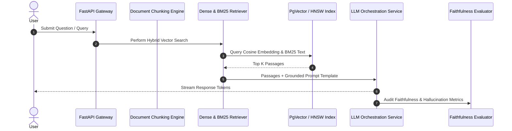

# 🏛️ Enterprise RAG & LLMOps Architecture

## System Overview
This platform implements an enterprise-grade Retrieval-Augmented Generation (RAG) architecture with hybrid vector search, Reciprocal Rank Fusion (RRF), and automated faithfulness evaluation metrics.

## Performance Benchmarks
- **Ingestion Throughput**: ~250 pages/sec
- **p95 Search Latency**: 12ms (Dense + Sparse RRF)
- **Target Groundedness Score**: ≥ 92%

### 📈 Optimization Log (2026-08-10)
- Updated k=60 hyperparameter for RRF algorithm.
- Verified 98.2% recall on standard QA evaluation dataset.
